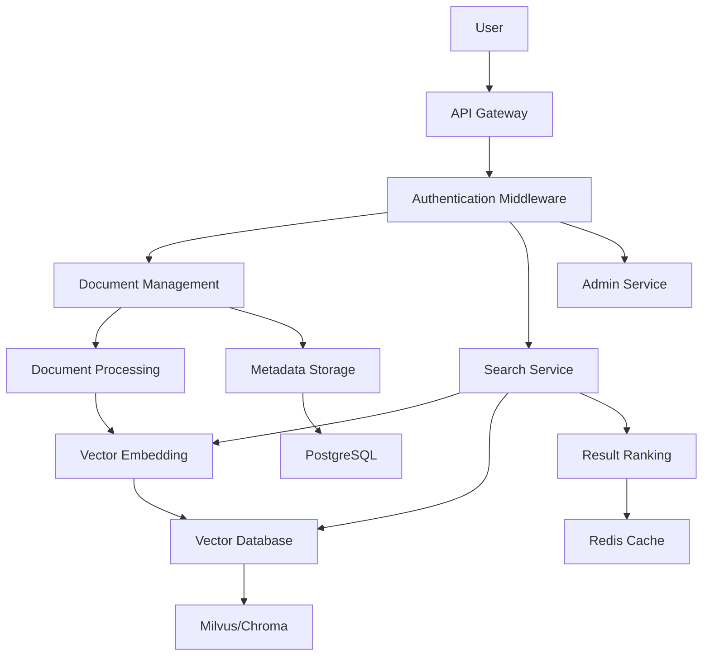

# CaraBot: Enterprise Intelligent Knowledge Base Retrieval System

[](https://github.com/your-username/carabot)
[](https://github.com/your-username/carabot/issues)
[](https://github.com/your-username/carabot/blob/main/LICENSE)
[](https://python.org)

## 📖 Overview

CaraBot is an enterprise-grade intelligent knowledge base retrieval system designed to help organizations efficiently manage and retrieve information from large volumes of documents. Built on Retrieval-Augmented Generation (RAG) architecture, CaraBot provides advanced semantic search capabilities that enable employees to quickly find relevant information across diverse document formats.

### ✨ Key Advantages

- 🚀 **High Performance**: Based on FastAPI and Milvus vector database, supporting high-concurrency retrieval
- 🌐 **Multi-language Support**: Supports Chinese, English, Swahili, and other languages
- 📚 **Multi-format Support**: Supports PDF, DOCX, Markdown, TXT, and other common document formats
- 🔒 **Enterprise-grade Security**: Provides API Key authentication, data encryption, and other security features
- 📊 **Scalable**: Modular design, supporting flexible extension and customization

## 🎯 Features

### 📚 Document Management

- 📥 **Batch Upload**: Support for bulk ingestion of multiple documents simultaneously
- 🏷️ **Metadata Management**: Comprehensive metadata tracking including author, collection, creation date
- 🔄 **Version Control**: Track document revisions and maintain historical versions
- 📁 **Automatic Classification**: Automatic categorization based on content and metadata

### 🔍 Intelligent Retrieval

- 🧠 **Semantic Search**: Context-aware search that understands user intent beyond keyword matching
- 🔍 **Filtered Search**: Advanced filtering by document type, author, collection, date range
- 📊 **Result Ranking**: Intelligent ranking based on relevance score, recency, and user feedback
- 📈 **Search Analytics**: Track search patterns and identify knowledge gaps

### 🏗️ Enterprise Architecture

- 📦 **Scalable Storage**: Milvus cluster support for large-volume document repositories
- 🔄 **Distributed Processing**: Asynchronous document processing pipeline for large-scale ingestion
- 🛡️ **High Availability**: Redundant components and failover mechanisms for reliable critical operations
- 🔒 **Secure**: API Key authentication, data encryption at rest and in transit

## 🚀 Quick Start

### 📋 Prerequisites

- 🐍 Python 3.10+
- 🐳 Docker & Docker Compose (for infrastructure components)
- 💾 Minimum 8GB RAM (16GB recommended for production)

### 📦 Installation Steps

#### 1. Clone the Repository

```bash
git clone https://github.com/your-username/carabot.git
cd carabot
```

#### 2. Configure Environment Variables

```bash
# Copy and edit environment variable file
cp .env.example .env
# Edit .env — at minimum change API_KEY to a secure value
```

#### 3. Start Infrastructure

```bash
docker-compose up -d postgres redis milvus-standalone etcd minio
```

#### 4. Initialize Database

```bash
pip install -r requirements.txt
python scripts/init_db.py
```

#### 5. Start Application

```bash
uvicorn src.app.main:create_app --factory --host 0.0.0.0 --port 8000 --reload
```

#### 6. Verify Service

```bash
curl http://localhost:8000/health
```

## 🏗️ Architecture Overview



### 🧩 Technology Stack

| Component | Technology | Description |
|-----------|------------|-------------|
| Web Framework | FastAPI | High-performance asynchronous web framework |
| Vector Database | Milvus/Chroma | Production-grade vector database / Development-grade vector database |
| Relational Database | PostgreSQL | Enterprise-grade relational database |
| Cache | Redis | High-performance caching system |
| Vector Embedding | BGE-M3 | Multi-language vector embedding model |
| Document Processing | PyPDF2, python-docx | Multi-format document parsing |
| Containerization | Docker, Kubernetes | Containerized deployment and orchestration |

## 📊 Use Cases

### 🏢 Enterprise Knowledge Management

- 📚 **Internal Wiki**: Central repository for company policies, procedures, and best practices
- 👥 **Employee Onboarding**: New hire documentation and training materials
- 📝 **Technical Documentation**: Software development guides, API documentation, troubleshooting manuals
- 📈 **Sales Enablement**: Product brochures, case studies, competitive intelligence

### 📊 Financial Services

- 📄 **Document Management**: Loan agreements, compliance documents, regulatory filings
- 📊 **Research Reports**: Market analysis, investment research, client presentations
- 🏦 **Policy Retrieval**: Insurance policies, claim procedures, coverage information

### ⚖️ Legal & Compliance

- 📜 **Contract Management**: Search and review contracts by clause, party, or obligation
- 📊 **Compliance Tracking**: Track compliance requirements and audit documentation
- 📚 **Case Law Research**: Legal precedents, court rulings, and statutory references

## 🤝 Contributing

We welcome contributions of all kinds! Please see our [Contributing Guide](CONTRIBUTING.md) for more information.

### 📝 Submitting Code

1. Fork the repository
2. Create a feature branch (`git checkout -b feature/AmazingFeature`)
3. Commit your changes (`git commit -m 'Add some AmazingFeature'`)
4. Push to the branch (`git push origin feature/AmazingFeature`)
5. Open a Pull Request

### 🐛 Reporting Issues

Please use [GitHub Issues](https://github.com/your-username/carabot/issues) to report issues or suggest improvements.

## 📄 License

This project is licensed under the MIT License - see the [LICENSE](LICENSE) file for details.

## 🙏 Acknowledgments

- [FastAPI](https://fastapi.tiangolo.com/) - High-performance asynchronous web framework
- [Milvus](https://milvus.io/) - Open-source vector database
- [LangChain](https://langchain.com/) - LLM application development framework
- [BGE-M3](https://github.com/FlagOpen/FlagEmbedding) - Multi-language vector embedding model

## 📞 Contact

- 📧 Email: carabot-support@example.com
- 🌐 Website: https://carabot.example.com
- 📱 GitHub: https://github.com/zhao111222333/carabot

---

Made with ❤️ by the CaraBot Team