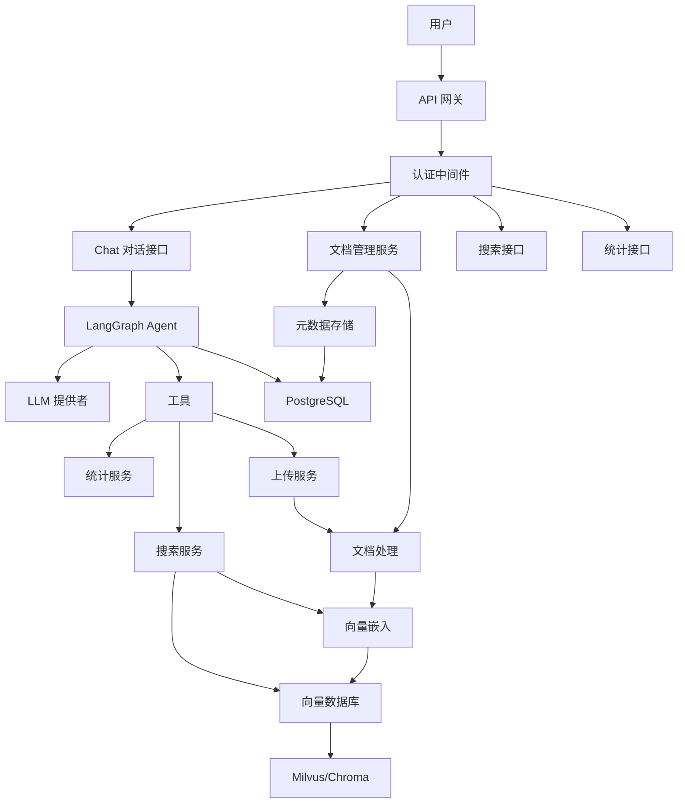

# CaraBot: Agent 驱动的智能知识库系统

[](https://github.com/zhao111222333/carabot)
[](https://github.com/zhao111222333/carabot/issues)
[](https://github.com/zhao111222333/carabot/blob/main/LICENSE)
[](https://python.org)

---

### [🌐 English Version](README_en.md)

## 📖 项目概述

CaraBot 是一个基于 LangGraph 和 RAG（检索增强生成）架构的 Agent 驱动智能知识库系统。它将语义搜索与 LLM 驱动的对话 AI 相结合，支持自然语言与文档库交互。内置的 ReAct Agent 能够自主搜索、检索和摄入文档，准确高效地回答用户查询。

### ✨ 核心优势

- 🚀 **高性能**：基于 FastAPI 和 Milvus 向量数据库，支持高并发检索
- 🤖 **Agent 驱动**：LangGraph ReAct Agent，具备工具调用能力，自主操作知识库
- 💬 **对话式 AI**：支持多轮对话，通过 SSE 流式输出，兼容 OpenAI 接口的 LLM
- 🌐 **多语言支持**：支持中文、英文、斯瓦希里语等多种语言
- 📚 **多格式支持**：支持 PDF、DOCX、Markdown、TXT 等常见文档格式
- 🔒 **企业级安全**：提供 API Key 认证、数据加密等安全特性
- 📊 **可扩展**：模块化设计，支持灵活扩展和定制

## 🎯 功能特性

### 🤖 Agent 对话

- 💬 **自然语言对话**：通过 `POST /api/v1/chat` 与知识库对话交互
- 🔧 **工具调用**：Agent 自主调用搜索、统计、文本入录等工具完成用户需求
- 🔄 **多轮对话**：基于 PostgreSQL Checkpoint 持久化对话状态（thread_id）
- ⚡ **流式 SSE**：实时 token 级流式输出，即时响应
- 🔌 **灵活 LLM**：兼容 OpenAI、DeepSeek、Qwen、vLLM 等所有 OpenAI 兼容接口

### 📚 文档管理

- 📥 **批量上传**：支持同时批量摄入多个文档
- 🏷️ **元数据管理**：全面的元数据跟踪，包括作者、集合、创建日期
- 🔄 **版本控制**：跟踪文档修订，维护历史版本
- 📁 **自动分类**：基于内容和元数据的自动分类

### 🔍 智能检索

- 🧠 **语义搜索**：上下文感知搜索，超越关键词匹配理解用户意图
- 🔍 **过滤搜索**：按文档类型、作者、集合、日期范围进行高级过滤
- 📊 **结果排序**：基于相关度得分、时效性和用户反馈的智能排序
- 📈 **搜索分析**：跟踪搜索模式，识别知识缺口

### 🏗️ 企业级架构

- 📦 **可扩展存储**：Milvus 集群支持，适用于大容量文档库
- 🔄 **分布式处理**：异步文档处理管道，支持大规模摄入
- 🛡️ **高可用性**：冗余组件和故障转移机制，确保关键操作的可靠性
- 🔒 **安全可靠**：API Key 认证、数据加密（静态和传输中）

## 🚀 快速开始

### 📋 环境要求

- 🐍 Python 3.10+
- 🐳 Docker 和 Docker Compose（用于基础设施组件）
- 💾 最低 8GB RAM（生产环境建议 16GB）

### 📦 安装步骤

#### 1. 克隆项目

```bash
git clone https://github.com/zhao111222333/carabot.git
cd carabot
```

#### 2. 配置环境变量

```bash
# 复制并编辑环境变量文件
cp .env.example .env
# 编辑 .env —— 至少需要将 API_KEY 修改为安全的值
```

#### 3. 启动基础设施

```bash
docker-compose up -d postgres redis milvus-standalone etcd minio
```

#### 4. 初始化数据库

```bash
pip install -r requirements.txt
python scripts/init_db.py
```

#### 5. 启动应用

```bash
uvicorn src.app.main:create_app --factory --host 0.0.0.0 --port 8000 --reload
```

#### 6. 验证服务

```bash
curl http://localhost:8000/health
```

## 🏗️ 架构概述



### 🧩 技术栈

| 组件 | 技术栈 | 说明 |
|------|--------|------|
| Web 框架 | FastAPI | 高性能异步 Web 框架 |
| Agent 框架 | LangGraph | ReAct Agent 状态图编排 + Checkpoint 持久化 |
| LLM 集成 | OpenAI 兼容接口 | 支持 OpenAI、DeepSeek、Qwen、vLLM 等 |
| 向量数据库 | Milvus/Chroma | 生产级向量数据库/开发级向量数据库 |
| 关系数据库 | PostgreSQL | 企业级关系数据库 + Agent 对话 Checkpoint |
| 缓存 | Redis | 高性能缓存系统 |
| 向量嵌入 | BGE-M3 | 多语言向量嵌入模型 |
| 文档处理 | PyPDF2、python-docx | 多格式文档解析 |
| 容器化 | Docker、Kubernetes | 容器化部署和编排 |

## 📊 应用场景

### 🏢 企业知识管理

- 📚 **内部 Wiki**：公司政策、流程和最佳实践的集中存储库
- 👥 **员工入职**：新员工文档和培训材料
- 📝 **技术文档**：软件开发指南、API 文档、故障排除手册
- 📈 **销售支持**：产品手册、案例研究、竞争情报

### 📊 金融服务

- 📄 **文档管理**：贷款协议、合规文档、监管申报
- 📊 **研究报告**：市场分析、投资研究、客户演示
- 🏦 **政策检索**：保险政策、理赔流程、保障信息

### ⚖️ 法律与合规

- 📜 **合同管理**：按条款、合作方或义务搜索和审查合同
- 📊 **合规跟踪**：跟踪合规要求和审计文档
- 📚 **判例法研究**：法律先例、法院裁决和法规参考

## 🤝 贡献指南

我们欢迎任何形式的贡献！请参阅 [贡献指南](CONTRIBUTING.md) 获取更多信息。

### 📝 提交代码

1. Fork 项目
2. 创建特性分支 (`git checkout -b feature/AmazingFeature`)
3. 提交更改 (`git commit -m 'Add some AmazingFeature'`)
4. 推送到分支 (`git push origin feature/AmazingFeature`)
5. 打开 Pull Request

### 🐛 报告问题

请使用 [GitHub Issues](https://github.com/zhao111222333/carabot/issues) 报告问题或提出建议。

## 📄 许可证

本项目采用 MIT 许可证 - 请参阅 [LICENSE](LICENSE) 文件了解详情。

## 🙏 致谢

- [FastAPI](https://fastapi.tiangolo.com/) - 高性能异步 Web 框架
- [Milvus](https://milvus.io/) - 开源向量数据库
- [LangChain](https://langchain.com/) - LLM 应用开发框架
- [LangGraph](https://langchain-ai.github.io/langgraph/) - Agent 编排框架
- [BGE-M3](https://github.com/FlagOpen/FlagEmbedding) - 多语言向量嵌入模型

## 📞 联系方式

- 📱 GitHub：https://github.com/zhao111222333/carabot

---

Made with ❤️ by the CaraBot Team
