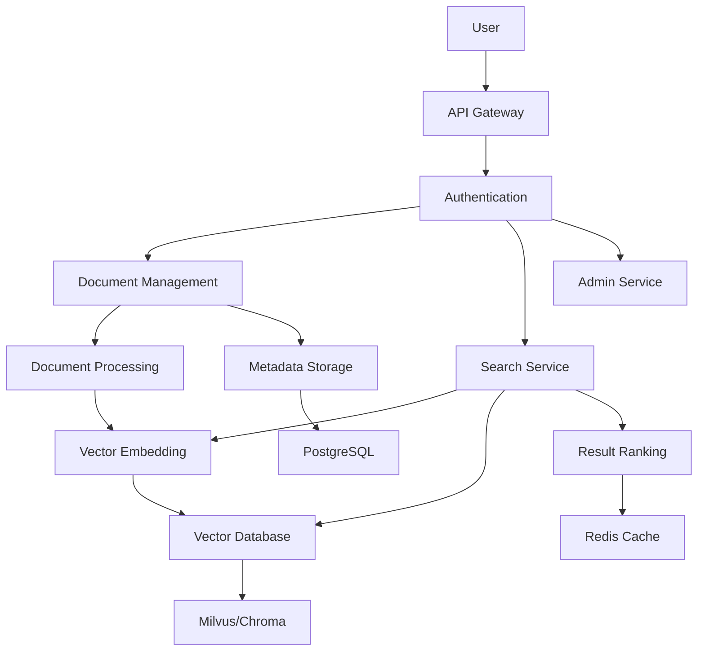

# CaraBot

# CaraBot: Enterprise Intelligent Knowledge Base Retrieval System

Enterprise multi-language RAG knowledge retrieval system — replicating the core capabilities of Transsion Carlcare AICC.

[中文版 (Chinese Version)](README_zh.md)

## Overview

CaraBot is an enterprise-grade intelligent knowledge base retrieval system designed to help organizations efficiently manage and retrieve information from large volumes of documents. Built on Retrieval-Augmented Generation (RAG) architecture, CaraBot provides advanced semantic search capabilities that enable employees to quickly find relevant information across diverse document formats.

## Key Capabilities

- **Enterprise Document Management**: Centralized repository for all organizational documents with version control and access management
- **Multi-format Document Ingestion**: Support for PDF, DOCX, Markdown, TXT and other common document formats
- **Advanced Semantic Retrieval**: Powered by state-of-the-art vector embeddings for accurate context-aware search
- **Multi-language Support**: BGE-m3 model supporting Chinese, English, Swahili and other languages
- **Dual Vector Storage**: Milvus (production-grade, scalable) / Chroma (development, lightweight) — switchable via configuration
- **Intelligent Document Deduplication**: SHA256 hash-based deduplication with incremental update support
- **Role-based Access Control**: Fine-grained permission management for document collections
- **Structured Logging & Monitoring**: Per-request trace_id for distributed tracing and comprehensive health monitoring
- **Performance Optimization**: Redis caching layer for frequent queries and result ranking optimization

## Features

### 📚 Document Management
- **Batch Document Upload**: Support for bulk ingestion of multiple documents simultaneously
- **Document Metadata Management**: Comprehensive metadata tracking including author, collection, creation date
- **Version Control**: Track document revisions and maintain historical versions
- **Document Classification**: Automatic categorization based on content and metadata

### 🔍 Intelligent Retrieval
- **Semantic Search**: Context-aware search that understands user intent beyond keyword matching
- **Multi-modal Search**: Support for text queries with potential extension to image and audio
- **Filtered Search**: Advanced filtering by document type, author, collection, date range
- **Result Ranking**: Intelligent ranking based on relevance score, recency, and user feedback
- **Search Analytics**: Track search patterns and identify knowledge gaps

### 🏗️ Enterprise Architecture
- **Scalable Vector Storage**: Milvus cluster support for high-volume document repositories
- **Distributed Processing**: Asynchronous document processing pipeline for large-scale ingestion
- **High Availability**: Redundant components and failover mechanisms for critical operations
- **Security**: API Key authentication, data encryption at rest and in transit

### 📊 Administration & Analytics
- **Knowledge Base Statistics**: Comprehensive metrics on document count, storage usage, search frequency
- **Performance Monitoring**: Real-time monitoring of system health and performance metrics
- **Audit Logs**: Detailed logging of all user actions and system operations
- **Export Capabilities**: Export search results and analytics reports in multiple formats

## Quick Start

### Prerequisites

- Python 3.10+
- Docker & Docker Compose (for infrastructure components)
- Minimum 8GB RAM (16GB recommended for production use)

### 1. Clone and configure

```bash
git clone <repo-url>
cd CaraBot

# Copy and edit the environment file
cp .env.example .env
# Edit .env — at minimum change API_KEY to a secure value
```

### 2. Start infrastructure

```bash
docker-compose up -d postgres redis milvus-standalone etcd minio
```

### 3. Initialize the database

```bash
pip install -r requirements.txt
python scripts/init_db.py
```

### 4. Start the application

```bash
uvicorn src.app.main:create_app --factory --host 0.0.0.0 --port 8000 --reload
```

### 5. Verify

```bash
curl http://localhost:8000/health
```

## API Documentation

All `/api/v1/*` endpoints require `X-API-Key` header. The `/health` endpoint is public.

### POST /api/v1/upload

Upload and index a document.

```bash
curl -X POST http://localhost:8000/api/v1/upload \
  -H "X-API-Key: your-api-key" \
  -F "file=@document.pdf" \
  -F "author=John Doe" \
  -F "collection=employee_handbook"
```

**Response:**
```json
{
  "document_id": "550e8400-e29b-41d4-a716-446655440000",
  "filename": "document.pdf",
  "file_hash": "abc123...",
  "file_size": 102400,
  "chunk_count": 15,
  "is_duplicate": false,
  "message": "Document processed successfully."
}
```

### POST /api/v1/search

Search the knowledge base.

```bash
curl -X POST http://localhost:8000/api/v1/search \
  -H "X-API-Key: your-api-key" \
  -H "Content-Type: application/json" \
  -d '{"query": "How to request annual leave?", "top_k": 5, "threshold": 0.7}'
```

**Response:**
```json
{
  "query": "How to request annual leave?",
  "total_results": 3,
  "results": [
    {
      "document_id": "550e8400-...",
      "content": "To request annual leave, submit a request through the HR portal at least 2 weeks in advance...",
      "score": 0.8921,
      "metadata": {"filename": "employee_handbook.pdf", "author": "HR Department"}
    }
  ],
  "search_time_ms": 45.32
}
```

### GET /api/v1/stats

Get knowledge base statistics.

```bash
curl -H "X-API-Key: your-api-key" http://localhost:8000/api/v1/stats
```

### GET /health

Health check — no auth required.

```bash
curl http://localhost:8000/health
```

**Response:**
```json
{
  "status": "up",
  "checks": {
    "db": {"status": "up", "detail": null},
    "vector_store": {"status": "up", "detail": null},
    "model": {"status": "up", "detail": null},
    "redis": {"status": "up", "detail": null}
  }
}
```

## Environment Variables

See [.env.example](.env.example) for all configuration options.

| Variable | Required | Default | Description |
|---|---|---|---|
| `API_KEY` | **Yes** | — | API key for request authentication |
| `VECTOR_STORE_TYPE` | No | `milvus` | `milvus` or `chroma` |
| `MILVUS_HOST` | If Milvus | `localhost` | Milvus server hostname |
| `MILVUS_PORT` | No | `19530` | Milvus server port |
| `DB_URL` | **Yes** | — | PostgreSQL connection string (asyncpg) |
| `REDIS_URL` | No | `redis://localhost:6379/0` | Redis connection string |
| `BGE_MODEL_PATH` | No | `./data/models/bge-m3` | Local model cache directory |
| `BGE_MODEL_NAME` | No | `BAAI/bge-m3` | HuggingFace model identifier |
| `CHUNK_SIZE` | No | `500` | Text chunk size |
| `CHUNK_OVERLAP` | No | `50` | Chunk overlap |
| `TOP_K` | No | `5` | Default search result count |
| `SIMILARITY_THRESHOLD` | No | `0.7` | Minimum similarity score |
| `LOG_LEVEL` | No | `INFO` | Logging level |
| `LOG_FILE` | No | `./logs/carabot.log` | Log file path |
| `LOG_FORMAT` | No | `json` | `json` or `text` |

## Running Tests

```bash
pytest tests/ -v

# With coverage
pytest tests/ -v --cov=src/app --cov-report=term-missing
```

## Deployment

### Docker Compose (full stack)

```bash
# Build and start all services
docker-compose up -d --build
```

### Production considerations

1. **Security Hardening**: Set a strong `API_KEY` (at least 32 random characters), configure TLS termination, implement network segmentation
2. **Scalable Architecture**: Use a dedicated Milvus cluster with replication for high availability
3. **Database Optimization**: Configure PostgreSQL with read replicas, connection pooling, and regular backups
4. **Performance Tuning**: Adjust `WORKERS` based on CPU cores (typically `2 * cores + 1`), optimize Redis cache settings
5. **Monitoring & Alerting**: Set up Prometheus/Grafana monitoring, configure alerting for critical system metrics
6. **Disaster Recovery**: Implement regular backups for all data stores, test recovery procedures
7. **Capacity Planning**: Monitor system usage and plan for horizontal scaling based on expected document volume

## Project Structure

```
cara-bot/
├── src/app/
│   ├── api/              # API routes and middleware
│   │   ├── routes/       # upload, search, stats, health
│   │   └── __init__.py   # Router registration
│   ├── core/             # Config, logging, exceptions
│   ├── models/           # SQLAlchemy ORM, Pydantic schemas
│   ├── services/         # Business logic
│   ├── vectorstore/      # Vector store abstraction (Milvus/Chroma)
│   ├── middleware/        # Auth, logging, error handling
│   └── main.py           # Application factory
├── tests/                # Unit tests
├── scripts/              # init_db, evaluate
├── docker-compose.yml
├── Dockerfile
├── requirements.txt
├── .env.example
└── README.md
```

## Architecture Overview



## Application Scenarios

### 🏢 Enterprise Knowledge Management
- **Internal Wiki**: Central repository for company policies, procedures, and best practices
- **Employee Onboarding**: New hire documentation and training materials
- **Technical Documentation**: Software development guides, API documentation, troubleshooting manuals
- **Sales Enablement**: Product brochures, case studies, competitive intelligence

### 📊 Financial Services
- **Document Management**: Loan agreements, compliance documents, regulatory filings
- **Research Reports**: Market analysis, investment research, client presentations
- **Policy Retrieval**: Insurance policies, claim procedures, coverage information

### ⚖️ Legal & Compliance
- **Contract Management**: Search and review contracts by clause, party, or obligation
- **Regulatory Compliance**: Track compliance requirements and audit documentation
- **Case Law Research**: Legal precedents, court rulings, and statutory references

### 🏥 Healthcare
- **Medical Records**: Secure storage and retrieval of patient records with access controls
- **Clinical Guidelines**: Treatment protocols, drug information, and medical research
- **Insurance Claims**: Process claims by referencing policy documents and medical records

## License

Internal use.

## Contributing

Contributions are welcome! Please see our [Contribution Guide](CONTRIBUTING.md) for more information.

## Support

For support, please contact the CaraBot development team at carabot-support@example.com.