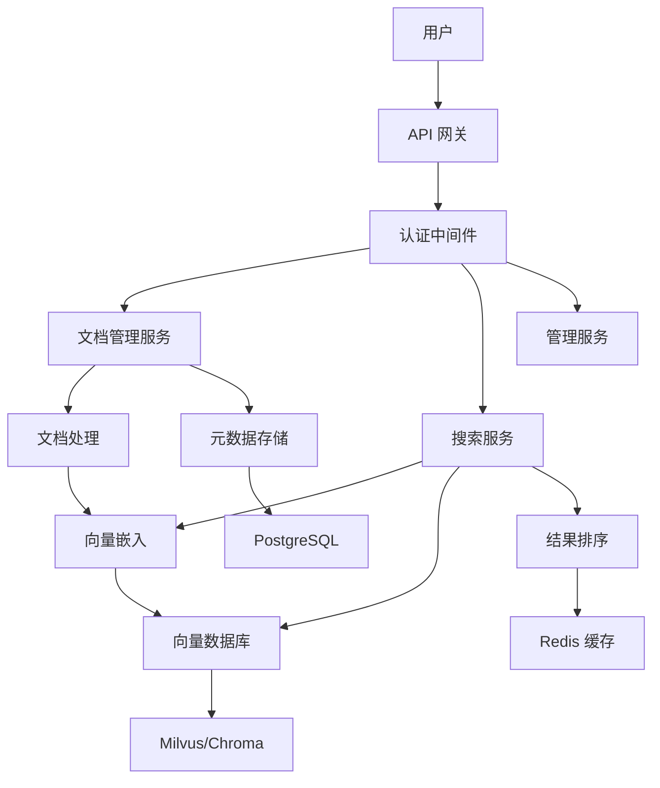

# CaraBot: 企业级智能知识库检索系统

企业级多语言 RAG 知识检索系统（传音 Carlcare AICC 核心能力）。

## 项目概述

CaraBot 是一款面向企业场景的智能知识库检索系统，旨在帮助组织高效管理和检索海量文档信息。基于 Retrieval-Augmented Generation (RAG) 架构，CaraBot 提供先进的语义搜索能力，使员工能够快速在多样化的文档格式中找到相关信息。

## 核心能力

- **企业级文档管理**：集中式存储库，支持版本控制和访问管理
- **多格式文档解析**：支持 PDF、DOCX、Markdown、TXT 等常见文档格式
- **高级语义检索**：基于最先进的向量嵌入技术，提供准确的上下文感知搜索
- **多语言支持**：BGE-m3 模型，支持中文、英文、斯瓦希里语等多种语言
- **双向量存储架构**：Milvus（生产级、可扩展）/ Chroma（开发级、轻量级），通过配置切换
- **智能文档去重**：基于 SHA256 哈希的去重机制，支持增量更新
- **角色化权限控制**：细粒度的文档集合权限管理
- **结构化日志与监控**：每个请求带 trace_id，便于分布式追踪和全面健康监控
- **性能优化**：Redis 缓存层，优化频繁查询和结果排序

## 功能特性

### 📚 文档管理
- **批量文档上传**：支持同时批量摄入多个文档
- **文档元数据管理**：全面的元数据跟踪，包括作者、集合、创建日期
- **版本控制**：跟踪文档修订，维护历史版本
- **文档分类**：基于内容和元数据的自动分类

### 🔍 智能检索
- **语义搜索**：上下文感知搜索，超越关键词匹配理解用户意图
- **多模态搜索**：支持文本查询，可扩展至图像和音频
- **过滤搜索**：按文档类型、作者、集合、日期范围进行高级过滤
- **结果排序**：基于相关度得分、时效性和用户反馈的智能排序
- **搜索分析**：跟踪搜索模式，识别知识缺口

### 🏗️ 企业级架构
- **可扩展向量存储**：Milvus 集群支持，适用于大容量文档库
- **分布式处理**：异步文档处理管道，支持大规模摄入
- **高可用性**：冗余组件和故障转移机制，确保关键操作的可靠性
- **安全性**：API Key 认证、数据加密（静态和传输中）

### 📊 管理与分析
- **知识库统计**：全面的文档数量、存储使用、搜索频率等指标
- **性能监控**：实时监控系统健康和性能指标
- **审计日志**：详细记录所有用户操作和系统操作
- **导出功能**：以多种格式导出搜索结果和分析报告

## 快速开始

### 环境要求

- Python 3.10+
- Docker 和 Docker Compose（用于基础设施组件）
- 最低 8GB RAM（生产环境建议 16GB）

### 1. 克隆并配置

```bash
git clone <repo-url>
cd CaraBot

# 复制并编辑环境变量文件
cp .env.example .env
# 编辑 .env —— 至少需要将 API_KEY 修改为安全的值
```

### 2. 启动基础设施

```bash
docker-compose up -d postgres redis milvus-standalone etcd minio
```

### 3. 初始化数据库

```bash
pip install -r requirements.txt
python scripts/init_db.py
```

### 4. 启动应用

```bash
uvicorn src.app.main:create_app --factory --host 0.0.0.0 --port 8000 --reload
```

### 5. 验证

```bash
curl http://localhost:8000/health
```

## API 文档

所有 `/api/v1/*` 接口均需携带 `X-API-Key` 请求头。`/health` 接口无需认证。

### POST /api/v1/upload

上传并索引文档。

```bash
curl -X POST http://localhost:8000/api/v1/upload \
  -H "X-API-Key: your-api-key" \
  -F "file=@document.pdf" \
  -F "author=张三" \
  -F "collection=员工手册"
```

**响应示例：**
```json
{
  "document_id": "550e8400-e29b-41d4-a716-446655440000",
  "filename": "document.pdf",
  "file_hash": "abc123...",
  "file_size": 102400,
  "chunk_count": 15,
  "is_duplicate": false,
  "message": "文档处理成功。"
}
```

### POST /api/v1/search

搜索知识库。

```bash
curl -X POST http://localhost:8000/api/v1/search \
  -H "X-API-Key: your-api-key" \
  -H "Content-Type: application/json" \
  -d '{"query": "如何申请年假？", "top_k": 5, "threshold": 0.7}'
```

**响应示例：**
```json
{
  "query": "如何申请年假？",
  "total_results": 3,
  "results": [
    {
      "document_id": "550e8400-...",
      "content": "申请年假需提前两周通过 HR 门户提交申请...",
      "score": 0.8921,
      "metadata": {"filename": "员工手册.pdf", "author": "人力资源部"}
    }
  ],
  "search_time_ms": 45.32
}
```

### GET /api/v1/stats

获取知识库统计信息。

```bash
curl -H "X-API-Key: your-api-key" http://localhost:8000/api/v1/stats
```

### GET /health

健康检查 —— 无需认证。

```bash
curl http://localhost:8000/health
```

**响应示例：**
```json
{
  "status": "up",
  "checks": {
    "db": {"status": "up", "detail": null},
    "vector_store": {"status": "up", "detail": null},
    "model": {"status": "up", "detail": null},
    "redis": {"status": "up", "detail": null}
  }
}
```

## 环境变量

完整配置项参见 [.env.example](.env.example)。

| 变量 | 是否必填 | 默认值 | 说明 |
|---|---|---|---|
| `API_KEY` | **是** | — | API 请求认证密钥 |
| `VECTOR_STORE_TYPE` | 否 | `milvus` | 向量存储类型：`milvus` 或 `chroma` |
| `MILVUS_HOST` | Milvus 时必填 | `localhost` | Milvus 服务器主机名 |
| `MILVUS_PORT` | 否 | `19530` | Milvus 服务器端口 |
| `DB_URL` | **是** | — | PostgreSQL 连接字符串（asyncpg） |
| `REDIS_URL` | 否 | `redis://localhost:6379/0` | Redis 连接字符串 |
| `BGE_MODEL_PATH` | 否 | `./data/models/bge-m3` | 本地模型缓存目录 |
| `BGE_MODEL_NAME` | 否 | `BAAI/bge-m3` | HuggingFace 模型标识符 |
| `CHUNK_SIZE` | 否 | `500` | 文本分块大小 |
| `CHUNK_OVERLAP` | 否 | `50` | 分块重叠大小 |
| `TOP_K` | 否 | `5` | 默认搜索结果数量 |
| `SIMILARITY_THRESHOLD` | 否 | `0.7` | 最低相似度阈值 |
| `LOG_LEVEL` | 否 | `INFO` | 日志级别 |
| `LOG_FILE` | 否 | `./logs/carabot.log` | 日志文件路径 |
| `LOG_FORMAT` | 否 | `json` | 日志格式：`json` 或 `text` |

## 运行测试

```bash
pytest tests/ -v

# 带覆盖率报告
pytest tests/ -v --cov=src/app --cov-report=term-missing
```

## 部署

### Docker Compose（完整技术栈）

```bash
# 构建并启动所有服务
docker-compose up -d --build
```

### 生产环境注意事项

1. **安全加固**：设置强密码 `API_KEY`（至少 32 位随机字符），配置 TLS 终止，实施网络分段
2. **可扩展架构**：使用带复制的专用 Milvus 集群，确保高可用性
3. **数据库优化**：配置 PostgreSQL 只读副本、连接池和定期备份
4. **性能调优**：根据 CPU 核数调整 `WORKERS`（通常为 `2 * CPU 核数 + 1`），优化 Redis 缓存设置
5. **监控与告警**：设置 Prometheus/Grafana 监控，配置关键系统指标的告警
6. **灾难恢复**：为所有数据存储实施定期备份，测试恢复流程
7. **容量规划**：监控系统使用情况，根据预期文档量规划水平扩展

## 项目结构

```
cara-bot/
├── src/app/
│   ├── api/              # API 路由和中间件
│   │   ├── routes/       # upload、search、stats、health
│   │   └── __init__.py   # 路由注册
│   ├── core/             # 配置、日志、异常
│   ├── models/           # SQLAlchemy ORM、Pydantic schema
│   ├── services/         # 业务逻辑
│   ├── vectorstore/      # 向量存储抽象层（Milvus/Chroma）
│   ├── middleware/        # 认证、日志、错误处理
│   └── main.py           # 应用工厂
├── tests/                # 单元测试
├── scripts/              # init_db、evaluate 脚本
├── docker-compose.yml
├── Dockerfile
├── requirements.txt
├── .env.example
├── README.md
└── README_zh.md
```

## 架构概述



## 应用场景

### 🏢 企业知识管理
- **内部 Wiki**：公司政策、流程和最佳实践的集中存储库
- **员工入职**：新员工文档和培训材料
- **技术文档**：软件开发指南、API 文档、故障排除手册
- **销售支持**：产品手册、案例研究、竞争情报

### 📊 金融服务
- **文档管理**：贷款协议、合规文档、监管申报
- **研究报告**：市场分析、投资研究、客户演示
- **政策检索**：保险政策、理赔流程、保障信息

### ⚖️ 法律与合规
- **合同管理**：按条款、合作方或义务搜索和审查合同
- **合规跟踪**：跟踪合规要求和审计文档
- **判例法研究**：法律先例、法院裁决和法规参考

### 🏥 医疗健康
- **医疗记录**：安全存储和检索患者记录，带访问控制
- **临床指南**：治疗方案、药物信息和医学研究
- **保险理赔**：通过参考政策文档和医疗记录处理理赔

## 许可证

内部使用。

## 贡献指南

欢迎贡献代码！请参阅我们的 [贡献指南](CONTRIBUTING.md) 获取更多信息。

## 技术支持

如需技术支持，请联系 CaraBot 开发团队：carabot-support@example.com。